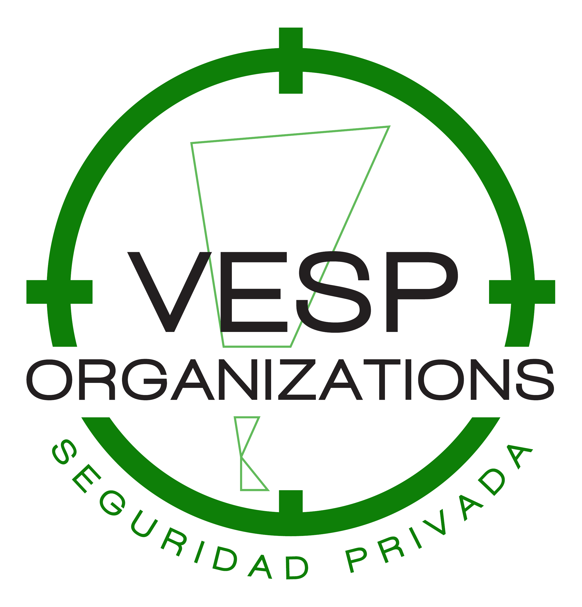

# Sistema de Control de Objetivos
### V.E.S.P Organizations – Seguridad Privada



---

## ¿De qué trata el sistema?

Sistema de escritorio desarrollado en Python para reemplazar el control manual en Excel de objetivos de seguridad privada.

Permite registrar y visualizar en tiempo real qué objetivos fueron controlados durante el día, qué supervisores estaban de turno, cuántas pasadas se realizaron por turno y generar reportes mensuales de cumplimiento.

---

## Tecnologías utilizadas

- **Python 3**
- **PyQt6** — Interfaz gráfica de escritorio
- **SQLite** — Base de datos local
- **bcrypt** — Encriptación de contraseñas
- **openpyxl** — Exportación a Excel
- **reportlab** — Exportación a PDF
- **requests** — Verificación de actualizaciones

---

## Instalación

### 1. Clonar el repositorio
```bash
git clone https://github.com/Taiuuu/sistema-control-objetivos.git
cd sistema-control-objetivos
```

### 2. Instalar dependencias
```bash
pip install PyQt6 openpyxl reportlab bcrypt requests
```

### 3. Ejecutar el sistema
```bash
python main.py
```

### 4. Credenciales por defecto
```
Usuario: admin
Contraseña: 0000
```

Al primer inicio se pedirá cambiar la contraseña.

---

## Funcionalidades

- Control diario de objetivos con estado por turno (día/noche)
- Registro de equipos de turno (dos supervisores por turno)
- Registro de pasadas con filtro automático por equipo de turno
- Tabla principal con colores de estado en tiempo real
- Filtros por turno, supervisor y estado
- Buscador de objetivos en tiempo real
- Notas y observaciones diarias
- Reporte mensual de cumplimiento por objetivo
- Exportación de reportes a Excel y PDF con logo corporativo
- Sistema de usuarios con roles (admin/operador)
- Historial de acciones (logs de auditoría)
- Backup automático diario de la base de datos
- Cierre de sesión automático por inactividad con backup previo
- Auto-actualización desde GitHub
- Atajos de teclado para operaciones frecuentes

---

## Atajos de teclado

| Atajo | Acción |
|-------|--------|
| Ctrl + P | Registrar pasada |
| Ctrl + O | Agregar objetivo |
| Ctrl + S | Agregar supervisor |
| Ctrl + T | Registrar turno |
| Ctrl + N | Notas del día |
| Ctrl + R | Reporte mensual |
| Ctrl + B | Actualizar tabla |
| Ctrl + H | Ayuda |

---

## Reset de fábrica

Para borrar todos los datos y dejar el sistema como nuevo:
```bash
python reset_fabrica.py
```

---

## Seguridad

- Contraseñas encriptadas con **bcrypt**
- Sistema de roles (admin/operador)
- Historial completo de acciones
- Backup automático diario
- Cierre de sesión por inactividad

---

## Estructura del proyecto
```
sistema-control-objetivos/
├── main.py
├── version.txt
├── reset_fabrica.py
├── assets/
│   └── vesp.png
├── database/
│   └── db.py
├── models/
│   ├── objetivos.py
│   ├── supervisores.py
│   └── turnos.py
├── services/
│   ├── actualizador.py
│   ├── backup.py
│   ├── exportar.py
│   ├── logger.py
│   ├── reportes.py
│   └── sesion.py
└── ui/
    ├── ayuda.py
    ├── cambiar_password.py
    ├── form_de_turno.py
    ├── form_objetivo.py
    ├── form_pasada.py
    ├── form_supervisor.py
    ├── gestionar_usuarios.py
    ├── lista_objetivos.py
    ├── lista_pasadas.py
    ├── lista_supervisores.py
    ├── login.py
    ├── notas_diarias.py
    ├── reporte_mensual.py
    ├── ventana_principal.py
    └── vista_logs.py
```

---

*Desarrollado para V.E.S.P Organizations – Seguridad Privada*
```